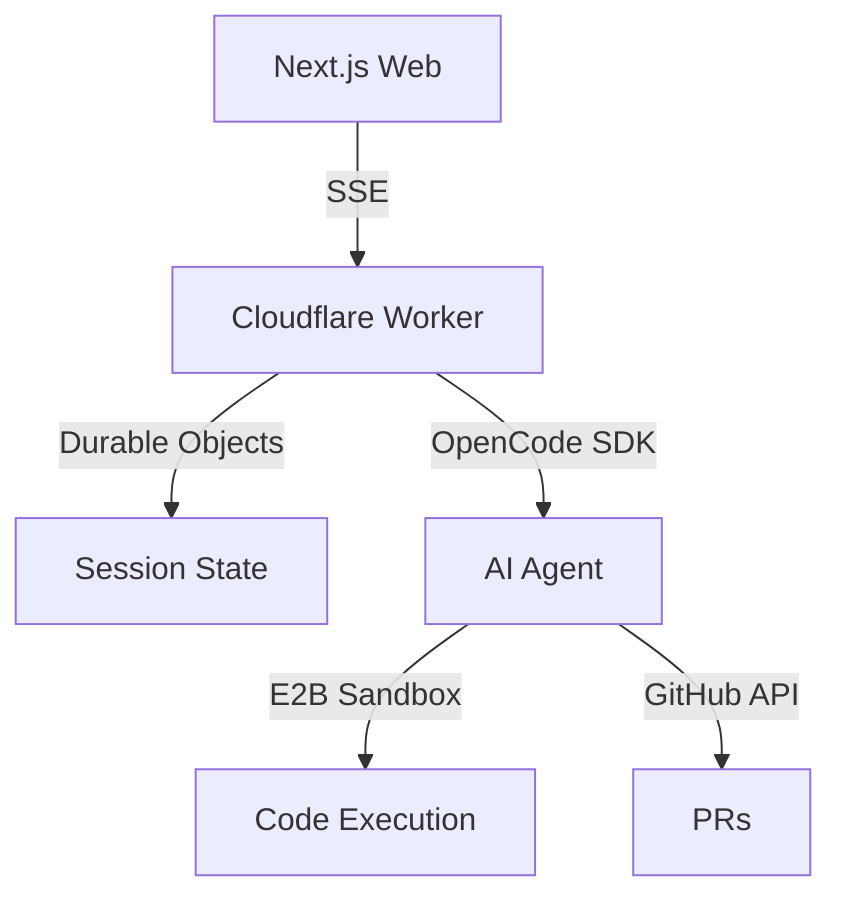

# Ship

A background agent platform for building software. Sign in with GitHub, chat with an AI agent (powered by OpenCode SDK) that works on code in sandboxed environments. The agent writes code, runs tests, and deploys while you focus on other things.

**Core value**: The agent works autonomously in the background on real coding tasks — you come back to working code, not just suggestions.

Inspired by Ramp's [Inspect background coding agent](https://builders.ramp.com/post/why-we-built-our-background-agent). Built by [@dylsteck](https://github.com/dylsteck).

---

## Demo

<video src="https://github.com/user-attachments/assets/8ca7aa09-9004-4d4d-8d83-d086403afa63" controls></video>

---

## Quick Start

### Prerequisites

- **Node.js** 20+ and **pnpm** 9+
- **Cloudflare account** (free tier)
- **GitHub account** (for OAuth)
- **E2B account** (for sandboxes) — [e2b.dev](https://e2b.dev)
- **Anthropic API key** (for the agent)

### 1. Clone and install

```bash
git clone <your-repo-url>
cd ship
pnpm install
```

### 2. Environment setup

**Web app** (`apps/web`):

```bash
cd apps/web
cp .env.example .env.local
```

Edit `.env.local`:

| Variable | Description |
|---------|-------------|
| `GITHUB_CLIENT_ID` | From [GitHub OAuth App](https://github.com/settings/developers) |
| `GITHUB_CLIENT_SECRET` | From same OAuth App |
| `SESSION_SECRET` | `openssl rand -hex 32` |
| `API_BASE_URL` | `http://localhost:8787` (local) |
| `NEXT_PUBLIC_API_URL` | Same as `API_BASE_URL` |
| `NEXT_PUBLIC_APP_URL` | `http://localhost:3000` |

**API** (`apps/api`):

```bash
cd apps/api
cp .dev.vars.example .dev.vars
```

Edit `.dev.vars`:

| Variable | Description |
|---------|-------------|
| `ANTHROPIC_API_KEY` | [console.anthropic.com](https://console.anthropic.com/settings/keys) |
| `E2B_API_KEY` | [e2b.dev/dashboard](https://e2b.dev/dashboard) → Settings → API Keys |
| `API_SECRET` | `openssl rand -hex 32` (must match web app expectations) |
| `ALLOWED_ORIGINS` | `http://localhost:3000` |

### 3. Database (D1)

```bash
cd apps/api
npx wrangler d1 create ship-db
```

Copy the `database_id` from the output into `wrangler.toml`:

```toml
[[d1_databases]]
binding = "DB"
database_name = "ship-db"
database_id = "your-database-id-here"
```

Apply schema:

```bash
npx wrangler d1 execute ship-db --local --file=src/db/schema.sql
```

### 4. GitHub OAuth App

1. [github.com/settings/developers](https://github.com/settings/developers) → **New OAuth App**
2. **Homepage URL**: `http://localhost:3000`
3. **Authorization callback URL**: `http://localhost:3000/api/auth/github/callback`
4. Copy Client ID and Client Secret into `apps/web/.env.local`

### 5. Run

```bash
pnpm dev
```

- **Web**: http://localhost:3000
- **API**: http://localhost:8787

---

## Contributing

### Commands

| Command | Description |
|---------|-------------|
| `pnpm dev` | Start web + API |
| `pnpm build` | Build all apps |
| `pnpm lint` | Lint |
| `pnpm type-check` | TypeScript check |

### API commands (from `apps/api`)

| Command | Description |
|---------|-------------|
| `npx wrangler dev` | Run Worker locally |
| `npx wrangler d1 execute ship-db --local --file=<sql>` | Run migration |
| `npx wrangler d1 execute ship-db --local --command="SELECT * FROM users"` | Query DB |
| `npx wrangler tail ship-api-production` | Stream prod logs |

### Code style

- **TypeScript** strict mode
- **pnpm** (not npm/yarn)
- **Named exports** preferred
- Keep components &lt; ~300 lines, functions &lt; ~100 lines

### PRs

- Use conventional commits: `feat:`, `fix:`, `chore:`, etc.
- One concern per PR
- Describe changes and what you tested

---

## How It Works

1. **Sign in** with GitHub OAuth
2. **Create a session** linked to a GitHub repo
3. **Chat** with the AI agent
4. **Agent runs** in an E2B sandbox — writes code, runs tests, creates PRs
5. **Watch progress** via SSE (tool calls, reasoning, file changes)
6. **Review & deploy** via MCP (Vercel, GitHub, docs)

---

## Architecture



### Tech stack

| Layer | Tech |
|-------|------|
| Monorepo | Turborepo, pnpm workspaces |
| Frontend | Next.js 16, React 19, Tailwind v4, Base UI |
| Backend | Cloudflare Workers (Hono), Durable Objects |
| Database | Cloudflare D1 (SQLite) |
| Auth | GitHub OAuth (Arctic), JWT (jose) |
| Sandboxes | E2B (OpenCode SDK) |
| Agents | OpenCode SDK (Claude, GPT-4, etc.) |
| MCP | Vercel, Grep, Context7 |
| Real-time | SSE, WebSockets |

### Project structure

```
ship/
├── apps/
│   ├── web/           # Next.js app
│   │   ├── app/       # Routes, dashboard, auth
│   │   ├── components/
│   │   └── lib/       # API client, SSE, DAL
│   └── api/           # Cloudflare Worker
│       ├── src/
│       │   ├── index.ts
│       │   ├── routes/       # Hono routes
│       │   ├── durable-objects/
│       │   └── lib/          # E2B, OpenCode, GitHub
│       ├── migrations/
│       └── wrangler.toml
└── packages/
    └── ui/            # Shared UI (@ship/ui)
```

---

## Deployment

### Cloudflare Worker (API)

```bash
cd apps/api

# First time: create prod DB, run schema, set secrets
npx wrangler d1 create ship-db-production
# Add database_id to wrangler.toml [env.production.d1_databases]

npx wrangler d1 execute ship-db-production --file=src/db/schema.sql --env production
npx wrangler secret put ANTHROPIC_API_KEY --env production
npx wrangler secret put API_SECRET --env production
npx wrangler secret put E2B_API_KEY --env production

# Deploy
npx wrangler deploy --env production
```

### Vercel (Web)

1. Import repo at [vercel.com/new](https://vercel.com/new)
2. **Root Directory**: `apps/web`
3. Add env vars: `GITHUB_CLIENT_ID`, `GITHUB_CLIENT_SECRET`, `SESSION_SECRET`, `API_BASE_URL`, `NEXT_PUBLIC_API_URL`, `NEXT_PUBLIC_APP_URL`
4. Create a **separate** GitHub OAuth App for production URLs

### Checklist

- [ ] Worker deployed with prod D1 + secrets
- [ ] Vercel project with `apps/web` root
- [ ] Production GitHub OAuth App (callback = prod URL)
- [ ] Test: sign in, create session, chat with agent

---

## License

MIT
