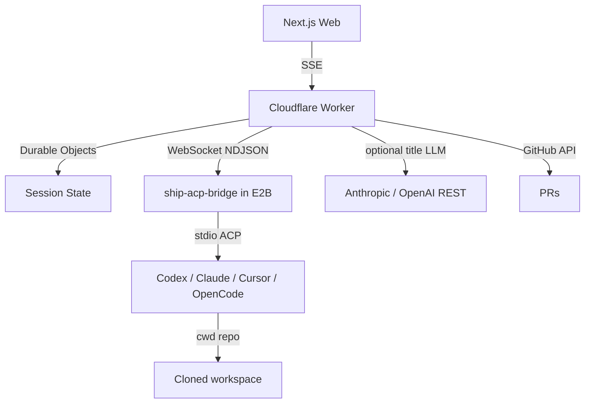

# Ship

A background agent platform for building software. Sign in with GitHub, chat with an AI coding agent that runs **inside an E2B sandbox** via the **Agent Client Protocol (ACP)**. The Worker orchestrates workspace setup, opens a **WebSocket bridge** to an in-VM relay (`ship-acp-bridge`), and streams assistant output over SSE. The agent writes code, runs tests, and opens PRs while you focus on other things.

**Core value**: The agent works autonomously in the background on real coding tasks — you come back to working code, not just suggestions.

**Architecture in one line**: ACP-compatible backends (`codex-acp`, `claude-agent-acp`, Cursor `agent acp`, `opencode acp`) run **in the sandbox** with `cwd` on the cloned repo; the Cloudflare Worker is a thin orchestrator (no AI SDK tool loop).

Inspired by Ramp's [Inspect background coding agent](https://builders.ramp.com/post/why-we-built-our-background-agent) and Vercel Labs' [open-agents](https://github.com/vercel-labs/open-agents) (which informed the out-of-VM agent design and the AI SDK + Streamdown streaming approach). Built by [@dylsteck](https://github.com/dylsteck).

---

## Demo

<video src="https://github.com/user-attachments/assets/ed0df63a-7fe5-444c-8647-037cc23446cc" controls></video>

---

## Quick Start

### Prerequisites

- **Node.js** 20+ and **pnpm** 9+
- **Cloudflare account** (free tier)
- **GitHub account** (for OAuth)
- **E2B account** (for sandboxes) — [e2b.dev](https://e2b.dev)
- **Anthropic and/or OpenAI API keys** (optional but recommended) — session **title generation** uses REST from the Worker; ACP backends may also use these keys for `authenticate` (e.g. Codex / Claude flows).
- **ACP backend CLIs** in your E2B image (or `npx` at cold start) — see `packages/sandbox/README.md`.
- Optional: **Cursor** (`CURSOR_API_KEY` / `CURSOR_AUTH_TOKEN`) and **OpenCode** (`OPENCODE_API_KEY`) on the Worker for single-tenant auth injection into the sandbox during bridge bootstrap.

### 1. Clone and install

```bash
git clone <your-repo-url>
cd ship
pnpm install
```

### 2. Environment setup

**Web app** (`apps/web`):

```bash
cd apps/web
cp .env.example .env.local
```

Edit `.env.local`:

| Variable               | Description                                                     |
| ---------------------- | --------------------------------------------------------------- |
| `GITHUB_CLIENT_ID`     | From [GitHub OAuth App](https://github.com/settings/developers) |
| `GITHUB_CLIENT_SECRET` | From same OAuth App                                             |
| `SESSION_SECRET`       | `openssl rand -hex 32`                                          |
| `API_BASE_URL`         | `http://localhost:8787` (local)                                 |
| `NEXT_PUBLIC_API_URL`  | Same as `API_BASE_URL`                                          |
| `NEXT_PUBLIC_APP_URL`  | `http://localhost:3000`                                         |

**API** (`apps/api`):

```bash
cd apps/api
cp .dev.vars.example .dev.vars
```

Edit `.dev.vars`:

| Variable                          | Description                                                             |
| --------------------------------- | ----------------------------------------------------------------------- |
| `ANTHROPIC_API_KEY`               | [console.anthropic.com](https://console.anthropic.com/settings/keys) — for Claude models (default) |
| `E2B_API_KEY`                     | [e2b.dev/dashboard](https://e2b.dev/dashboard) → Settings → API Keys    |
| `API_SECRET`                      | `openssl rand -hex 32` (must match web app expectations)                |
| `SESSION_SECRET`                  | Same as web app; for JWT verification                                   |
| `ALLOWED_ORIGINS`                 | `http://localhost:3000`                                                 |
| `OPENAI_API_KEY`                  | _(optional)_ Codex API-key auth (`openai-api-key` ACP method)                       |
| `CODEX_AUTH_JSON`                 | _(optional)_ Personal ChatGPT sub — paste `~/.codex/auth.json` after `codex login` |
| `CODEX_ACCESS_TOKEN`              | _(optional)_ Enterprise Codex token from [chatgpt.com/admin/access-tokens](https://chatgpt.com/admin/access-tokens) |
| `CURSOR_API_KEY` / `CURSOR_AUTH_TOKEN` | _(optional)_ Cursor `agent acp` auth                                         |
| `OPENCODE_API_KEY`                | _(optional)_ OpenCode `opencode acp`                                              |
| `LOGIN_RESTRICTED_TO_SINGLE_USER` | _(optional)_ `true` to restrict login to one user                       |
| `ALLOWED_USER_ID`                 | _(optional)_ Your user ID from `users` table (required when restricted) |

> **Tip:** For private instances, set `LOGIN_RESTRICTED_TO_SINGLE_USER=true` and `ALLOWED_USER_ID` to your user ID (from `SELECT id FROM users`) so only you can sign in.

### 3. Database (D1)

```bash
cd apps/api
npx wrangler d1 create ship-db
```

Copy the `database_id` from the output into `wrangler.toml`:

```toml
[[d1_databases]]
binding = "DB"
database_name = "ship-db"
database_id = "your-database-id-here"
```

Apply schema:

```bash
npx wrangler d1 execute ship-db --local --file=src/db/schema.sql
```

### 4. GitHub OAuth App

1. [github.com/settings/developers](https://github.com/settings/developers) → **New OAuth App**
2. **Homepage URL**: `http://localhost:3000`
3. **Authorization callback URL**: `http://localhost:3000/api/auth/github/callback`
4. Copy Client ID and Client Secret into `apps/web/.env.local`

### 5. Run

```bash
pnpm dev
```

- **Web**: http://localhost:3000
- **API**: http://localhost:8787

---

## Contributing

### Commands

| Command            | Description                   |
| ------------------ | ----------------------------- |
| `pnpm dev`         | Start web + API               |
| `pnpm build`       | Build all apps                |
| `pnpm lint`        | Lint                          |
| `pnpm type-check`  | TypeScript check              |
| `pnpm deploy`      | Deploy preview (web + API)    |
| `pnpm deploy:prod` | Deploy production (web + API) |

### API commands (from `apps/api`)

| Command                                                                   | Description        |
| ------------------------------------------------------------------------- | ------------------ |
| `npx wrangler dev`                                                        | Run Worker locally |
| `npx wrangler d1 execute ship-db --local --file=<sql>`                    | Run migration      |
| `npx wrangler d1 execute ship-db --local --command="SELECT * FROM users"` | Query DB           |
| `npx wrangler tail ship-api-production`                                   | Stream prod logs   |

### Code style

- **TypeScript** strict mode
- **pnpm** (not npm/yarn)
- **Named exports** preferred
- Keep components &lt; ~300 lines, functions &lt; ~100 lines

### PRs

- Use conventional commits: `feat:`, `fix:`, `chore:`, etc.
- One concern per PR
- Describe changes and what you tested

---

## How It Works

1. **Sign in** with GitHub OAuth.
2. **Create a session** linked to a GitHub repo.
3. **Chat** — your prompt hits the Cloudflare Worker.
4. The Worker **drops a bundled `ship-acp-bridge` script** into the sandbox, starts it on a localhost port, and waits for `/healthz`.
5. It opens a **TLS WebSocket** (E2B port forward) to the bridge with a per-session **bearer token** (`acp_bridge_token` in SessionDO meta; also passed as `?token=` for Worker WebSocket clients).
6. The bridge **spawns** the selected backend (`codex` \| `claude` \| `cursor` \| `opencode`) and forwards **NDJSON JSON-RPC** lines between the Worker and the child stdio.
7. ACP notifications are translated into Ship’s existing SSE (`message.part.updated`) for the web UI.
8. After the turn the Worker persists the assistant message and (optionally) triggers auto-commit / PR via the GitHub flow.

Bridge source: `packages/acp-bridge` (also embedded into `apps/api/src/generated/acp-bridge-bundled.ts` via `pnpm` `pretype-check` / `bundle:acp-bridge`).

---

## Architecture

For a detailed architecture overview, see [ARCHITECTURE.md](./ARCHITECTURE.md).


```mermaid
graph TD
    A[Next.js Web] -->|SSE| B[Cloudflare Worker]
    B -->|Durable Objects| C[Session State]
    B -->|WebSocket NDJSON| D[ship-acp-bridge in E2B]
    D -->|stdio ACP| E[Codex / Claude / Cursor / OpenCode]
    E -->|cwd repo| F[Cloned workspace]
    B -->|optional title LLM| M[Anthropic / OpenAI REST]
    B -->|GitHub API| G[PRs]
```

### Tech stack

| Layer     | Tech                                                                  |
| --------- | --------------------------------------------------------------------- |
| Monorepo  | Turborepo, pnpm workspaces                                            |
| Frontend  | Next.js 16, React 19, Tailwind v4, Base UI, Streamdown                |
| Backend   | Cloudflare Workers (Hono), Durable Objects                            |
| Database  | Cloudflare D1 (SQLite)                                                |
| Auth      | GitHub OAuth (Arctic), JWT (jose)                                     |
| Sandboxes | E2B (custom template with common dev tools pre-baked)                 |
| Agent     | **ACP in sandbox** (`packages/acp-bridge` + backend CLIs) — Worker is orchestrator only |
| Models    | Picker ids `ship-acp-{opencode,cursor,claude,codex}` (see `agent-registry.ts`)      |
| Real-time | SSE, WebSockets                                                       |

### Project structure

```
ship/
├── apps/
│   ├── web/                  # Next.js app
│   │   ├── app/              # Routes, dashboard, auth
│   │   ├── components/
│   │   └── lib/              # API client, SSE adapter
│   └── api/                  # Cloudflare Worker
│       ├── src/
│       │   ├── index.ts
│       │   ├── routes/       # Hono routes (chat, sessions, sandbox, models, git, …)
│       │   ├── durable-objects/session.ts
│       │   └── lib/
│       │       ├── chat-runner.ts          # Re-exports ACP turn driver
│       │       ├── chat-workspace.ts       # Sandbox + clone
│       │       ├── acp-chat-runner.ts      # ACP handshake + streaming turn
│       │       ├── acp-bridge-bootstrap.ts # Inject bridge + poll health
│       │       ├── acp-json-rpc.ts         # WS multiplexer + permission stubs
│       │       ├── generated/              # acp-bridge-bundled (esbuild output)
│       ├── migrations/
│       └── wrangler.toml
├── packages/sandbox/           # E2B adapter + custom template notes
├── e2b/                      # Custom E2B template (Dockerfile)
├── e2b.toml
└── packages/
    ├── acp-bridge/           # @ship/acp-bridge — in-VM WS ↔ stdio relay
    ├── sandbox/              # @ship/sandbox — Sandbox interface + E2B impl
    ├── types/                # @ship/types — shared types
    └── ui/                   # @ship/ui — shared UI components
```

---

## Deployment

**API** (Cloudflare Worker) from the repo root:

```bash
pnpm deploy        # default / preview Worker
pnpm deploy:prod   # production Worker (see apps/api/wrangler.toml)
```

**Web** (Next.js) is meant to run in **Docker** (see `apps/web/Dockerfile`), for example on [Coolify](https://coolify.io/docs/applications/nextjs). Build context must be the **repository root** so `packages/*` workspace deps resolve.

### Coolify (web)

Point Coolify at this repo and set:

| Field                 | Value                  |
| --------------------- | ---------------------- |
| Build Pack            | `Dockerfile`           |
| Base Directory        | `/`                    |
| Dockerfile Location   | `/apps/web/Dockerfile` |
| Ports Exposes         | `3000`                 |

Anything else (Install/Build/Start commands, Custom Docker Options) can stay empty — the Dockerfile handles it. If you leave Build Pack on Nixpacks, the build will fail with `Unsupported URL Type "workspace:"` because Nixpacks runs `npm i` and npm doesn't speak pnpm workspaces.

### Manual commands — Cloudflare Worker (API)

```bash
cd apps/api

# First time: create prod DB, run schema, set secrets
npx wrangler d1 create ship-db-production
# Add database_id to wrangler.toml [env.production.d1_databases]

npx wrangler d1 execute ship-db-production --file=src/db/schema.sql --env production
npx wrangler secret put ANTHROPIC_API_KEY --env production
npx wrangler secret put API_SECRET --env production
npx wrangler secret put E2B_API_KEY --env production
npx wrangler secret put SESSION_SECRET --env production  # Must match web app
# Optional, for Codex agent:
# npx wrangler secret put OPENAI_API_KEY --env production
# npx wrangler secret put CODEX_AUTH_JSON --env production   # personal ChatGPT sub (optional)
# npx wrangler secret put CODEX_ACCESS_TOKEN --env production  # enterprise Codex (optional)

# Deploy
npx wrangler deploy --env production
```

### Checklist

- [ ] API Worker deployed with prod D1 + secrets
- [ ] Web app deployed (Docker/Coolify) with env vars from `apps/web/.env.example`
- [ ] `ALLOWED_ORIGINS` on the API includes your web app URL
- [ ] Production GitHub OAuth App (callback = prod web URL)
- [ ] Test: sign in, create session, chat with agent

---

## License

MIT
